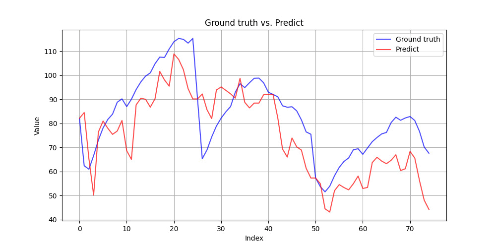
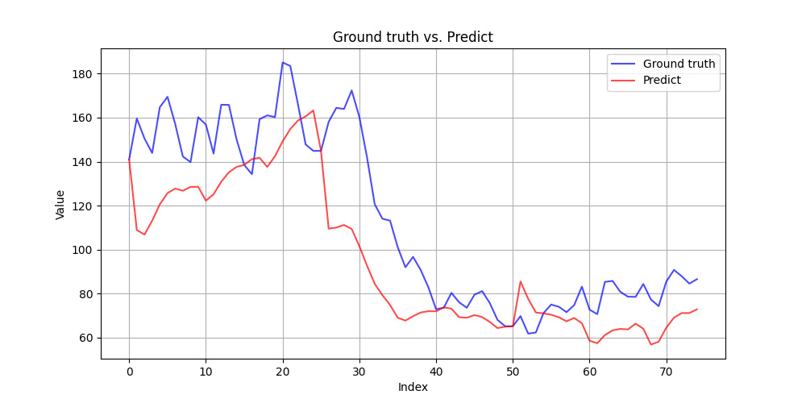

# Ứng dụng mạng nơ-ron đồ thị trong dự báo chất lượng không khí theo không gian và thời gian

## Tóm tắt

Đề tài tập trung nghiên cứu bài toán dự đoán mức độ ô nhiễm không khí, đặc biệt
là các hạt mịn PM2.5, trên một phạm vi rộng lớn. Điều này đòi hỏi sự xem xét kỹ lưỡng về nhiều yếu tố ảnh hưởng khác nhau
trong khoảng thời gian dài, trong đó gió là một yếu tố quan trọng. Với đề tài này,
chúng tôi đã đề xuất một mô hình sử dụng mạng đồ thị Graph Neural Networks (GNNs) để tái cấu trúc
không gian địa lý phản ánh mối quan hệ giữa các trạm đo. Đồng thời, kết hợp với mạng hồi quy (GRUs) cung cấp cho chúng tôi khả năng tạo ra một cấu trúc không
gian - thời gian để nghiên cứu sâu hơn về ảnh hưởng của gió.
Kết quả đạt được là chúng tôi có thể dự đoán chất lượng không khí ở các thời điểm tiếp theo ở những
khu vực khác nhau dưới tác động của gió.

## Tổng quan phương pháp

Dự án này sử dụng một mô hình tương tự T-GCN, tuy nhiên, ở phần GCN, chúng tôi cải thiện nó bằng cách thay thế với một cấu trúc GNN xuất của chúng tôi là PM2.5-GNN

### Dữ liệu

Dữ liệu trong 4 năm (01/01/2015 - 31/12/2018) được thu thập từ hai nguồn: 
* Ủy ban khí tượng Tầm trung Châu Âu (Dữ liệu về khí tượng)
* Bộ sinh thái môi trường Trung Quốc. (Dữ liệu về PM2.5)

### Kịch bản thực nghiệm

Dữ liệu được phân chia theo các năm hoặc theo các quý và theo các tháng
Chúng tôi chia dữ liệu thành 3 phần train, val và test. 

Như vậy chúng tôi có kịch bản dữ liệu để xây dựng mô hình như bảng sau:

| Kịch bản | Train                   | Validation              | Test                    |
|----------|-------------------------|-------------------------|-------------------------|
| 1        | 01/01/2015 - 31/12/2016 | 01/01/2017 - 31/12/2017 | 01/01/2018 - 31/12/2018 |
| 2        | 01/11/2015 - 28/02/2016 | 01/11/2016 - 28/02/2017 | 01/11/2017 - 28/02/2018 |
| 3        | 01/09/2016 - 30/11/2016 | 01/12/2016 - 31/12/2016 | 01/01/2017 - 31/1/2017  |

Để đồng nhất về thông tin lịch sử của mỗi mẫu dữ liệu. Các mẫu dữ liệu sẽ lấy 1 giờ đầu tiên làm đầu vào dự đoán cho 24 giờ tiếp theo, với dữ liệu về khí tượng được cập nhật liên tục.

# Kết quả

### Đánh giá

#### Kết quả thu được như sau

| Kịch bản | RMSE  µm/m3      | POS  % (ngưỡng ô nhiễm là 75µm/m3) |
|----------|------------------|------------------------------------|
| 1        | 19.8708 ± 0.1102 | 60.22 ± 5.68%                      |     
| 2        | 31.8403 ± 0.2502 | 66.40 ± 2.01%                      |      
| 3        | 43.8776 ± 0.2350 | 0.8451 ± 0.0048                     |      

#### Biều đồ biến động 
**Lưu ý:** Do có sự nhầm lẫn đánh máy nên đường màu **Xanh là đường Predict** và đường màu **Đỏ là đường Ground truth** ở kịch bản 1

**_Kịch bản 1_**

**_Kịch bản 2_**

_**Kịch bản 3**_

### Trực quan kết quả

# Hướng dẫn deploy app 
    * Cài đặt WSL2 với distros Ubuntu-22.04
    * Cài đặt Python 3.10 
    * Cài đặt Pytorch-GPU (Hoặc CPU)
    * Cài đặt các phụ thuộc bằng lệnh pip install requirements.txt
    * cd vào web, chạy lệnh streamlit run app.py

# Các nguồn tham khảo

### Khóa học
[Khóa học ML with Graph](https://web.stanford.edu/class/cs224w/)

### Bài báo
[Graph Neural Network for spatiotemporal data: methods and applications](https://arxiv.org/abs/2306.00012)

[T-GCN: A Temporal Graph Convolutional Network for Traffic Prediction](https://arxiv.org/abs/1811.05320)

[A3T-GCN:  An Attention-based Spatial-Temporal Graph Convolutional Network for Traffic Forecasting](https://arxiv.org/abs/2302.12973)

[PM2.5-GNN: A Domain Knowledge Enhanced Graph Neural Network For PM2.5 Forecasting](https://arxiv.org/abs/2002.12898)

[Self-supervised air quality estimation with graph neural network assistance and attention enhancement](https://www.researchgate.net/publication/379479025_Self-supervised_air_quality_estimation_with_graph_neural_network_assistance_and_attention_enhancement)

# Thực hiện
